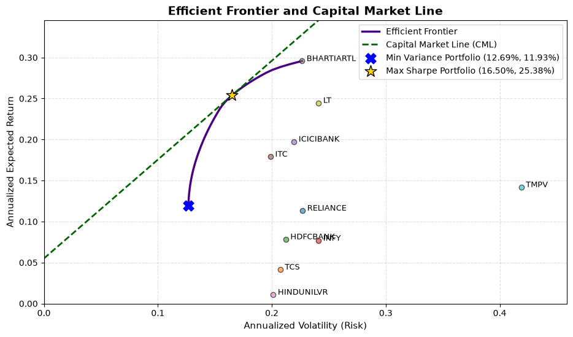

# MVPT Portfolio Optimization

## Project Objective & Overview
This framework builds an end-to-end mathematical pipeline to construct long-only optimal portfolios (Global Minimum Variance and Maximum Sharpe Ratio) across 10 diversified Indian large-cap equities using 5 years of daily historical pricing data (~1,250 observations per asset). Moving beyond traditional Gaussian assumptions, this project integrates non-parametric historical simulation to track empirical tail-risk exposures and tests portfolio structural symmetry.

## Methodology & Tech Stack
* **Optimization Framework:** Applied Modern Portfolio Theory (MPT) via Sequential Least Squares Programming (`SLSQP`) solvers to execute dual-allocation goals:
  1. **Global Minimum Variance (GMV):** Minimizing raw annualized portfolio risk ($w^T \Sigma w$).
  2. **Maximum Sharpe Ratio (MSR):** Maximizing risk-adjusted excess returns over the risk-free rate, benchmarking against the current **10-Year Indian Sovereign Bond Yield (~6.50%)**.
* **Constraints & Boundary Space:** Enforced a strict long-only capital space ($0 \le w_i \le 1$) with full asset allocation equality rules ($\sum w_i = 1$).
* **Tail-Risk Evaluation:** Modeled conditional expectations using 95% Value at Risk (VaR) and Expected Shortfall (ES) to evaluate true downside risk exposure.
* **Asymmetry Diagnostics:** Computed Downside Semi-Variance (DSSV) normalized directly against downside observations ($N_d$) to map the directional volatility split of the optimized target portfolio.
* **Core Toolkit:** Python, NumPy, Pandas, SciPy (Optimization & Stats), Matplotlib, yFinance.

---

## Optimization & Strategic Allocation Results

### 1. Optimal Asset Allocation Splits
The optimizer displays a classic asset-pricing contrast: the **Minimum Variance** allocation diversifies widely across multiple low-correlation sectors to dampen overall variance, while the **Maximum Sharpe** allocation aggressively concentrates capital into high-momentum defensive and infrastructure plays (`BHARTIARTL`, `LT`, and `ITC`) to maximize risk-adjusted performance.

| Equity Ticker | Sector Focus | Minimum Variance Weight | Maximum Sharpe Weight |
| :--- | :--- | :---: | :---: |
| **BHARTIARTL.NS** | Telecommunications | 12.48% | **50.29%** |
| **LT.NS** | Infrastructure / Engineering | 3.25% | **22.44%** |
| **ITC.NS** | FMCG / Conglomerates | 18.78% | **20.04%** |
| **ICICIBANK.NS** | Banking & Financials | 7.89% | 7.24% |
| **HINDUNILVR.NS**| FMCG / Consumer Goods | 22.60% | 0.00% |
| **TCS.NS** | IT Services | 17.29% | 0.00% |
| **HDFCBANK.NS** | Banking & Financials | 13.01% | 0.00% |
| **RELIANCE.NS** | Energy / Conglomerate | 4.71% | 0.00% |
| **INFY.NS** | IT Services | 0.00% | 0.00% |
| **TMPV.NS** | Automobile (Restructured) | 0.00% | 0.00% |

---

### 2. Target Portfolio Tail-Risk Diagnostics (MSR Allocation)
The conditional risk profile extracted from the Maximum Sharpe Ratio portfolio exposes the standard "volatility premium" trade-off: higher asset concentration shifts the empirical left tail downward relative to a fully diversified baseline.

| Risk Metric | Model Output | Financial & Statistical Interpretation |
| :--- | :--- | :--- |
| **95% Daily VaR** | `-1.52%` | There is a 5.0% historical probability that the portfolio will experience a daily log loss greater than 1.52%. |
| **95% Expected Shortfall (ES)** | `-2.23%` | Conditional on breaching the VaR threshold, the average expected loss on those catastrophic trading days is 2.23%. |
| **Daily Downside Semi-Variance** | `0.000055` | Measures pure negative return variance, stripping away positive target deviations. |
| **DSSV Share of Variance** | **`50.88%`** | Confirms tight structural symmetry. Despite high concentration, optimized variance remains perfectly balanced between up-moves and down-moves. |

---

## Framework Visualizations

### Modern Portfolio Theory Optimization Map
Plots the hyperbola of the efficient frontier alongside individual asset vectors. The **Capital Market Line (CML)** originates strictly at the $6.5\%$ sovereign risk-free intercept, running tangent directly through the Maximum Sharpe Portfolio star.

### Max Sharpe Portfolio: Daily Returns & Tail Risk Profile
Highlights the empirical log-returns distribution matched against a parametric Gaussian curve. This highlights the presence of **leptokurtosis (fat tails)** in real financial data, proving why a standard variance framework must be supplemented with conditional metrics like Expected Shortfall to protect capital.

