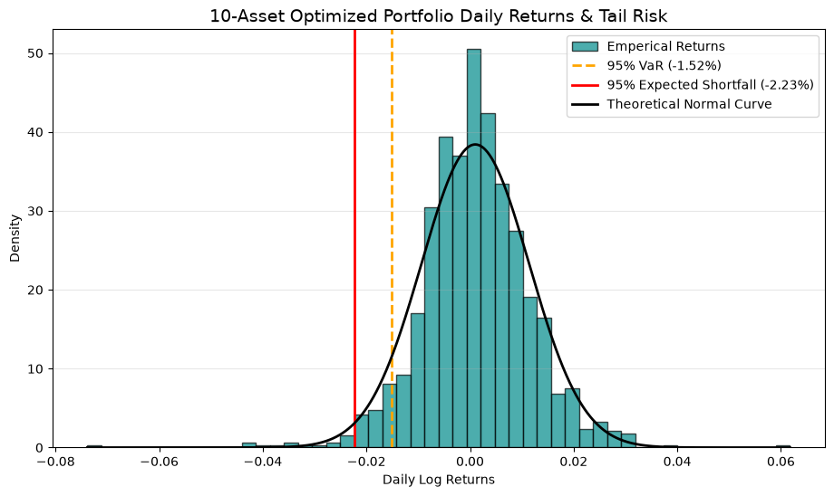

# MVPT_Optimization

# Portfolio Construction and Tail Risk Diagnostics

##  Project Objective & Overview
This framework builds an end-to-end mathematical pipeline to construct a long-only Minimum Variance Portfolio across 10 diversified Indian large-cap equities using historical market data. It implements historical simulation to extract empirical tail-risk diagnostics, moving beyond standard Gaussian risk assumptions.

##  Methodology & Tech Stack
* **Optimization Strategy:** Employed sequential least squares programming (`SLSQP`) to minimize annualized portfolio variance subject to full capital allocation constraints ($\sum w_i = 1$) and long-only bounds ($0 \le w_i \le 1$).
* **Tail-Risk Analytics:** Implemented non-parametric historical simulation to capture extreme tail exposures using 95% Value at Risk (VaR) and conditional Expected Shortfall (ES).
* **Asymmetry Diagnostics:** Computed Downside Semi-Variance (DSSV) normalized against total variance to quantify directional volatility splits.
* **Core Toolkit:** Python, NumPy, Pandas, SciPy, Matplotlib, yFinance.

##  Key Results & Performance
The model successfully converged to evaluate 5 years of daily pricing parameters (~1,250 observations per asset).

| Risk Metric | Model Output | Financial Interpretation |
| :--- | :--- | :--- |
| **95% Daily VaR** | `-1.21%` | 5% historical probability of experiencing a daily loss worse than 1.21%. |
| **95% Expected Shortfall (ES)** | `-1.74%` | The average expected loss on days when the VaR threshold is breached. |
| **DSSV Share** | `50.58%` | Confirms structural risk symmetry ($~50\%$) under standard variance minimization. |

### Portfolio Risk Distribution Profile

